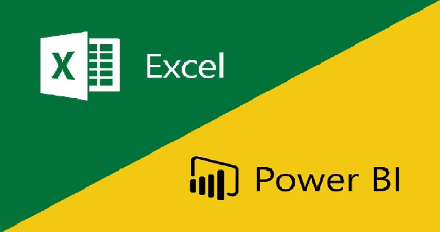
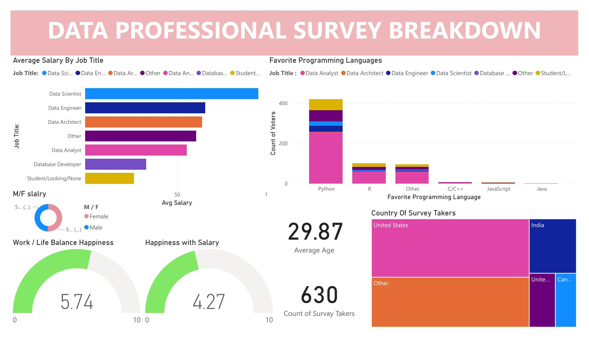

# Power BI Data Cleaning and Visualization

## Image ref.
[Excel & Power BI](https://medium.com/powerbiegitimleri-com/kurumsal-raporlamada-excelden-power-bi-a-ge%C3%A7mek-i%CC%87%C3%A7in-8-sebep-76788e7696c8)
## Introduction 

This GitHub repository contains a project focused on creating insightful visualizations using Power BI. The dataset used in this project required extensive cleaning before delving into visualization creation. Below are the steps taken to clean the dataset:

## Data Cleaning

1. **Creating a Copy:**
   - A copy of the original dataset was created in a separate worksheet to preserve the raw data without any modifications.

2. **Loading and Modifying the Dataset in Power BI:**
   - The dataset was loaded into Power BI, and the "Transform Data" window was utilized to modify and clean the data effectively.

3. **Deleting Empty Columns:**
   - Empty columns in the dataset were identified and removed to streamline the data.

4. **Simplifying Columns:**
   - The "Q1" column, representing detailed specializations, was split to maintain only the broader category, simplifying the analysis.

5. **Handling "Favorite Programming Language":**
   - Similar to "Q1," the "Q5 - Favorite Programming Language" column was processed to keep the most relevant choice for analysis.

6. **Splitting "Current Yearly Salary" and Calculating Average:**
   - The "Q3 - Current Yearly Salary (in USD)" column was split into two columns to separate numbers and calculate the average salary, providing better insights into income trends.

7. **Creating a New Column for Average Salaries:**
   - A new column was created to hold the calculated average salaries for survey takers.

8. **Processing "Q11 - Country" Column:**
   - Similar to previous steps, the "Q11" column, containing detailed addresses, was simplified to maintain only the relevant choice.

9. **Handling "Q4 - What Industry do you work in?":**
   - The "Q4" column, representing industries for each applicant, was also processed to make it more suitable for analysis.

## Visualization

After completing the data cleaning process, we proceeded to build our visualization dashboard. Our visualization includes several sections:

1. **Favorite Programming Language:** 
   - An insightful visualization depicting the distribution of favorite programming languages among survey participants.

2. **Average Salary by Job:** 
   - A visual representation of average salaries based on different job roles, providing valuable salary insights.

3. **Countries of Survey Takers:** 
   - A geographic representation showcasing the countries from which the survey takers originated.

4. **Metrics Analysis:** 
   - Various metrics, such as happiness with salary, work-life balance, and a gender comparison of salaries, are presented in an easy-to-understand format.

## Visualization Dashboard

## Dataset Information

For more details about the dataset, refer to the [dataset ](https://github.com/AlexTheAnalyst/Power-BI/blob/main/Power%20BI%20-%20Final%20Project.xlsx).

## Acknowledgments
This project was completed by following the instructions and guidance provided in the YouTube channel by [AlexTheAnalyst](https://www.youtube.com/@AlexTheAnalyst). Thank you for the insightful tutorials and practical data analysis techniques.

## Conclusion

This project demonstrates how we prepared the dataset through extensive cleaning before creating insightful visualizations using Power BI. The resulting dashboard provides valuable insights into the dataset and facilitates better understanding and decision-making.

Feel free to explore the code and visualizations in this repository. If you have any questions or suggestions, please don't hesitate to reach out.

Thank you for your interest!

## Contact
If you have any questions or suggestions regarding this project, feel free to contact me at [khalidhani1996@gmail.com](mailto:khalidhani1996@gmail.com).
